# Assignment Class 18: Containerizing a Django Web App with AWS, GitHub, and Docker

This guide outlines deploying a Django web app on AWS EC2 by cloning a GitHub repository, setting up the environment, containerizing with Docker, and enabling global access.

## Prerequisites
- AWS account with EC2 access
- GitHub repo: [django-todo](https://github.com/shreys7/django-todo)
- Basic Linux/SSH knowledge
- Optional: Python 3 and Docker installed locally

## Steps

### 1. Launch EC2 Instance
1. In AWS EC2 Dashboard, click `Launch Instance`.
2. Select Amazon Linux 2 or Ubuntu 20.04 LTS AMI.
3. Choose `t2.micro`, configure defaults, add 8 GB storage.
4. Create/select key pair (e.g., `my-key.pem`) and launch.
5. Note public IP.

### 2. SSH into EC2
```bash
ssh -i my-key.pem ec2-user@<your-ec2-public-ip>
```

### 3. Set Up Environment
1. Update packages:
   ```bash
   sudo apt update && sudo apt upgrade -y
   ```
   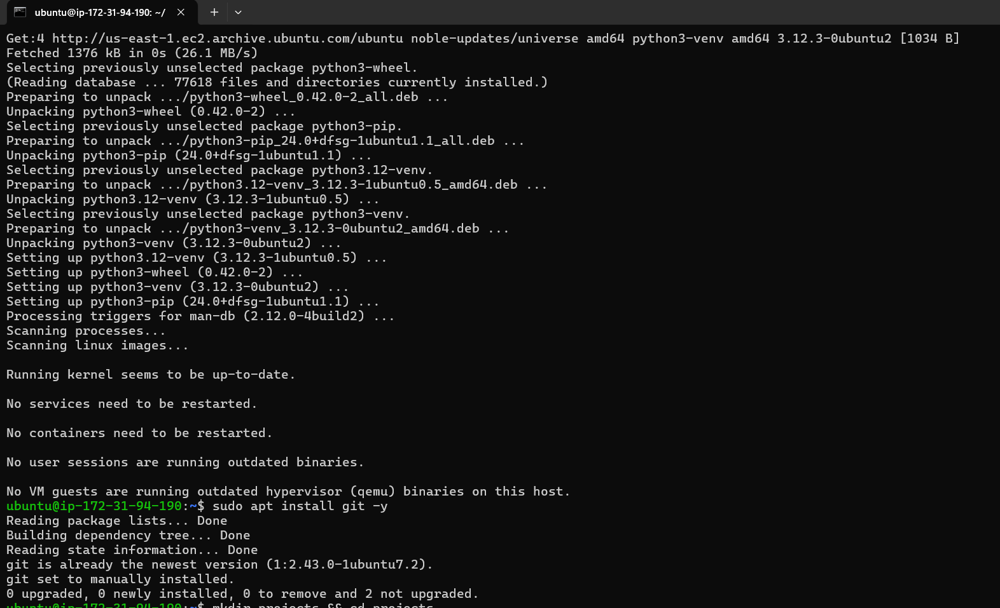
2. Install Python, pip, and Git:
   ```bash
   sudo apt install python3 python3-pip python3-venv git -y
   ```

### 4. Clone Repository
1. Create project directory:
   ```bash
   mkdir projects && cd projects
   ```
2. Clone and navigate:
   ```bash
   git clone https://github.com/shreys7/django-todo.git && cd django-todo
   ```
   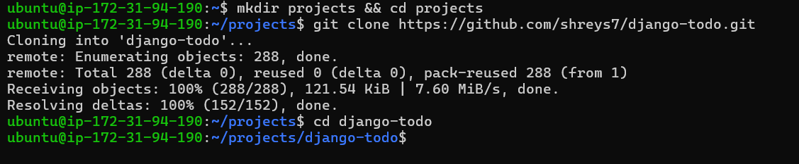

### 5. Configure Virtual Environment
1. Create and activate virtual environment:
   ```bash
   python3 -m venv myenv && source myenv/bin/activate
   ```
2. Install Django:
   ```bash
   pip install django==3.2
   ```
   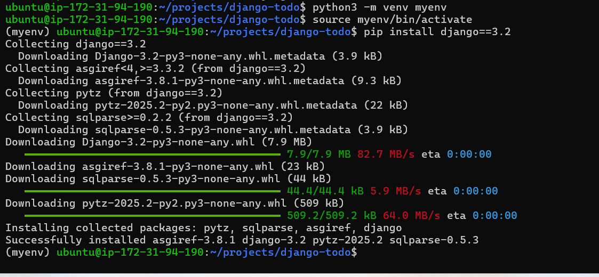

### 6. Run Django Locally
1. Apply migrations:
   ```bash
   python3 manage.py makemigrations && python3 manage.py migrate
   ```
2. Start server:
   ```bash
   python3 manage.py runserver 0.0.0.0:8001
   ```
   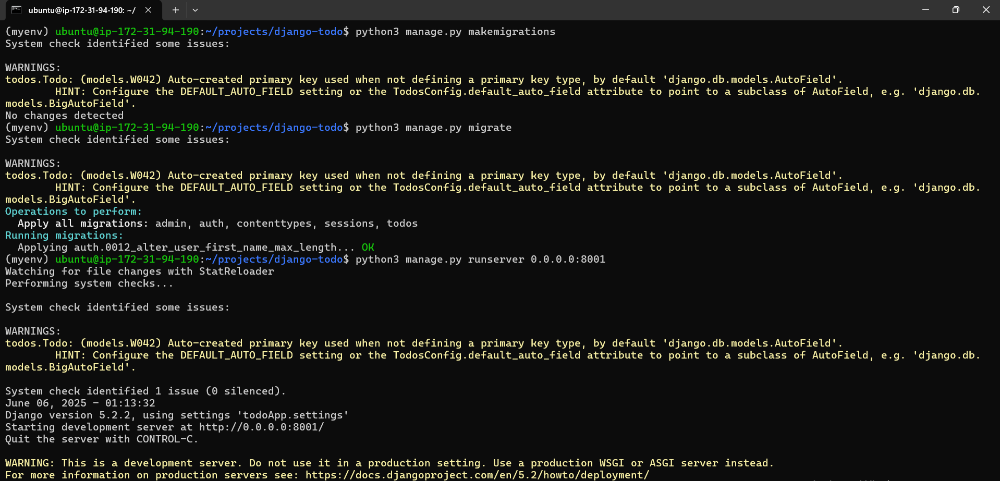

### 7. Update Security Group
1. In EC2 Dashboard, select instance’s security group.
2. Edit `Inbound Rules` to add:
   - Type: Custom TCP
   - Port: 8001
   - Source: 0.0.0.0/0
3. Save.
   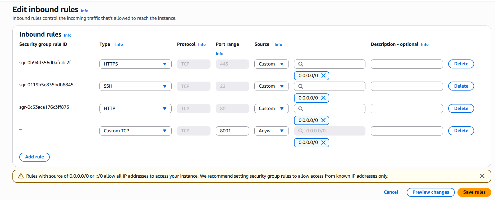
   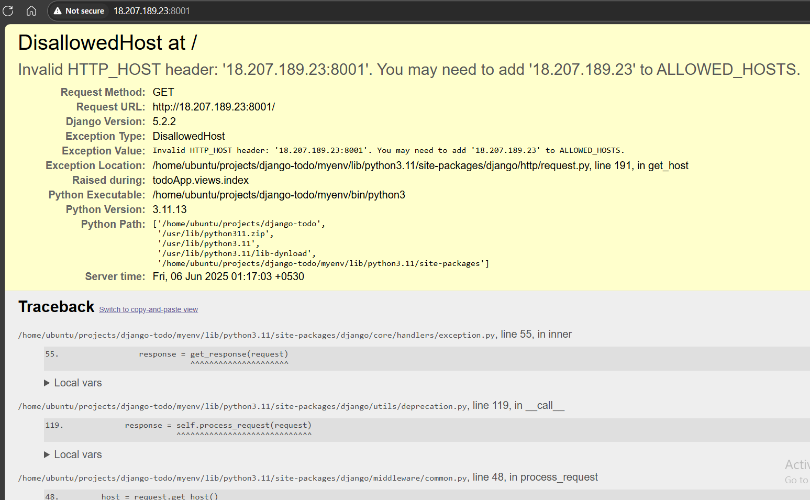

### 8. Update ALLOWED_HOSTS
1. Edit `todoApp/settings.py`:
   ```bash
   vi todoApp/settings.py
   ```
2. Set:
   ```python
   ALLOWED_HOSTS = ['<your-ec2-public-ip>', 'localhost']
   ```
   Or:
   ```python
   ALLOWED_HOSTS = ['*']
   ```
3. Restart server:
   ```bash
   python3 manage.py runserver 0.0.0.0:8001
   ```
   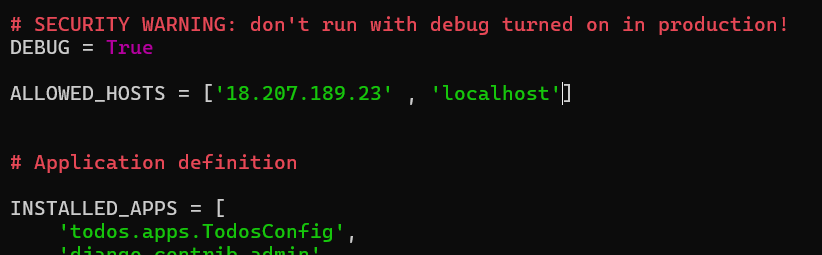
   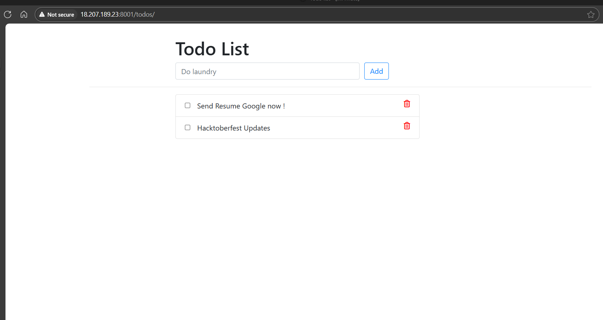
   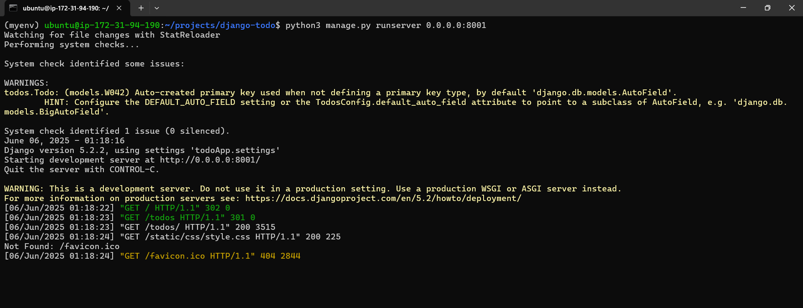

### 9. Create Dockerfile
1. Create `Dockerfile`:
   ```bash
   vi Dockerfile
   ```
2. Add:
   ```dockerfile
   FROM python:3.8
   WORKDIR /app
   COPY . .
   RUN pip install django==3.2
   RUN python manage.py migrate
   CMD ["python", "manage.py", "runserver", "0.0.0.0:8001"]
   ```
   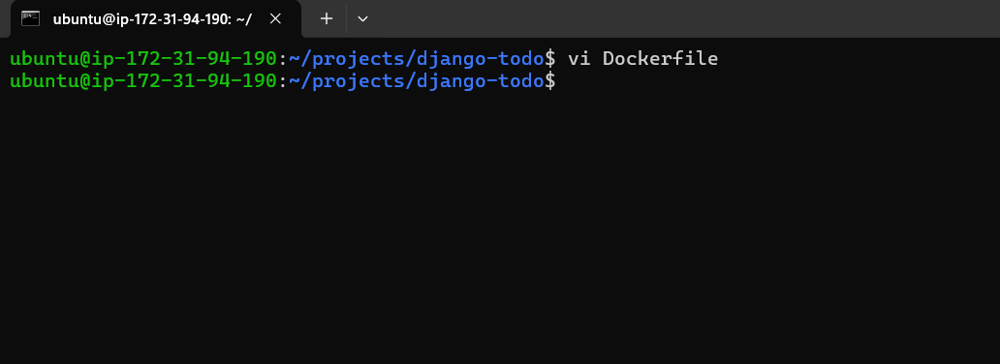
   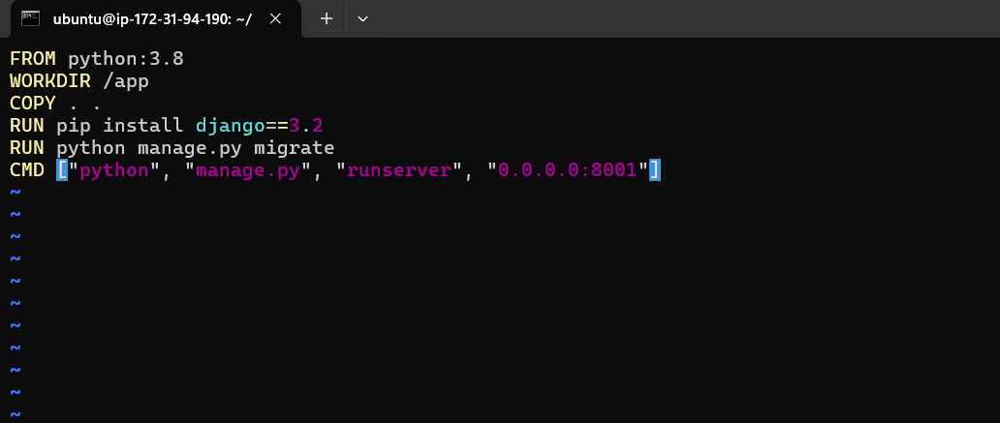

### 10. Install Docker
1. Install Docker:
   ```bash
   sudo apt-get install docker.io -y
   ```
2. Start and enable:
   ```bash
   sudo systemctl start docker && sudo systemctl enable docker
   ```
3. Add user to Docker group:
   ```bash
   sudo usermod -aG docker ubuntu
   ```
4. Reconnect:
   ```bash
   exit && ssh -i my-key.pem ec2-user@<your-ec2-public-ip>
   ```
   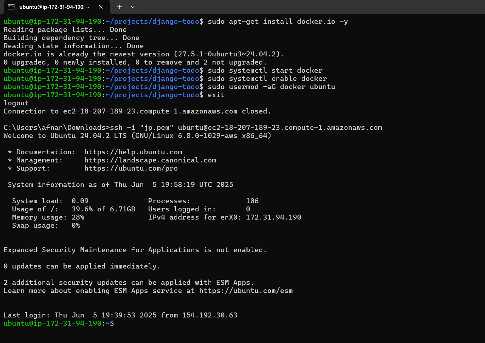

### 11. Build and Run Docker Container
1. Build image:
   ```bash
   docker build -t todo-app .
   ```
2. Run container:
   ```bash
   docker run -p 8001:8001 todo-app
   ```
   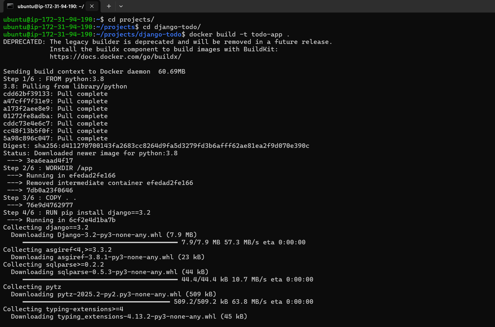
   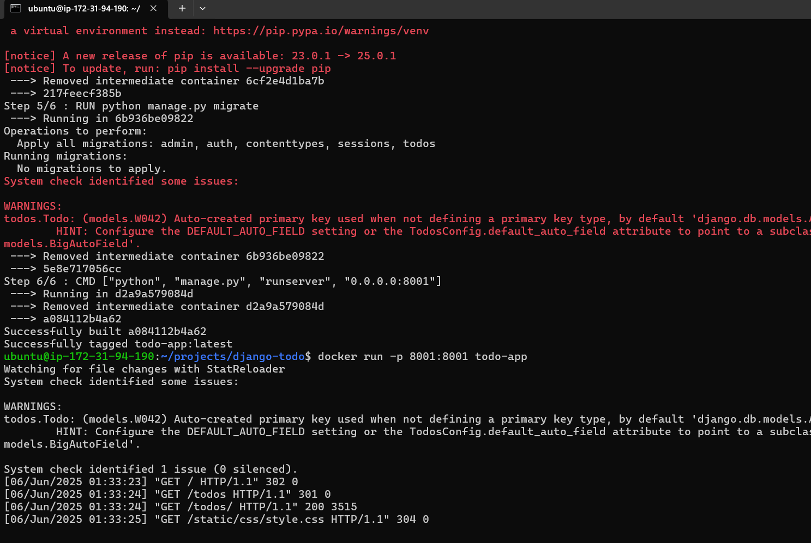

### 12. Access Application
- Visit `http://<your-ec2-public-ip>:8001`.
   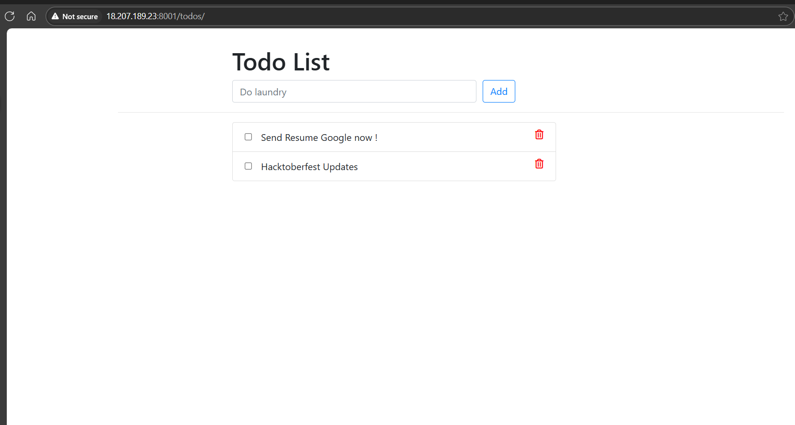

## Troubleshooting
- *Disallowed Host*: Ensure `ALLOWED_HOSTS` includes EC2 IP or use `['*']`.
- *Port Issues*: Verify port 8001 is open in security group.
- *Docker Problems*: Check Docker status (`systemctl status docker`) and user group.